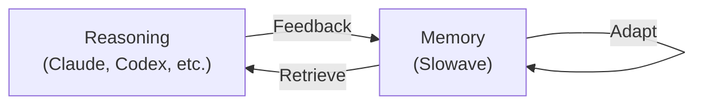
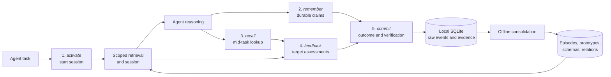

<!-- mcp-name: io.github.slowave-ai/slowave -->

---

<p align="center">
  
</p>
<p align="center">
  <b>Living memory layer across your coding agents and AI tools.</b>
</p>
<p align="center">
  <a href="https://pypi.org/project/slowave/"></a>
  
  
  
</p>
<p align="center">
  Supports: Claude Code, Codex, OpenCode, Cursor, Cline, Windsurf/Devin Desktop, Claude Desktop 
</p>


---
AI agents have large context windows, but that context ends with your current session.
Open a new session, switch from Claude Code to Codex, and you have to restate the same decisions, constraints, and failed attempts.

Slowave gives your agents one local, shared memory, without requiring a separate LLM for memory maintenance.

Slowave is an adaptive memory layer that approaches agent memory from a specific angle:

> **Reasoning and memory form a continuous feedback loop.**



Slowave retains what helps agents achieve their goals, weakens what does not, and continuously adapts based on use. It does this through a continuous feedback loop between your agent and its memory:

> **remember → recall → use → feedback → reinforce / weaken → decay**

Over time, your agent’s feedback shapes what Slowave returns, and your memories become reusable context for your agent to achieve its goals.

Memory is continuously reshaped by use rather than a static collection of facts waiting to be retrieved.

- **Keep context across tasks**: Your agents can reuse recorded decisions, preferences, constraints, and lessons instead of making you repeat them.
- **Improves with use:** Useful memories strengthen, irrelevant ones lose priority, stale knowledge can be suppressed or superseded.
- **Learns from experience:** Decisions, outcomes, and multi-step solutions can become reusable memories and procedures.
- **Runs locally:** Slowave stores memory in SQLite and does not send it to a hosted memory service.
- **No LLM API key:** The memory core performs maintenance and retrieval without LLM calls or an LLM API key.
- **Inspectable and measurable:** Review memories, retrievals, feedback, procedures, and system performance in the local dashboard.

The first useful payoff is simply not having to repeat the same constraint in the next task. 

Over time, the way you work becomes reusable context for your agent.

See [platform coverage and manual steps](#supported-clients).

## Installation

### Quick start
```bash
pipx install slowave
slowave setup --dry-run
slowave setup
```

The quick start configures every detected client. To configure just one client at a time, see the [installation reference](docs/install.md).

> [!IMPORTANT]
> **No LLM API key required.**

To remove Slowave, see the [removal guide](docs/install.md#remove-slowave).

## What changes in your workflow?

Slowave is transparent to your work. You keep working with your agent as usual. 

Slowave is strictly connected to your agent in both directions:

- **Agent → Slowave**: When your agent encounters a durable fact, decision, or procedure the installed lifecycle directs it to preserve that claim into Slowave.
- **Slowave → Agent**: At the beginning of each task Slowave may return a compact, scoped set of relevant recorded memories or procedures to your agent, so that it can act upon its own memories. 

What you will see while working with your agent:
- your agent activating Slowave for the current task and goal, 
- Slowave retrieving relevant context to your agent, 
- your agent sending feedback to Slowave on what was retrieved.
- your agent committing a Slowave session.

Optionally you will see:
- your agent invoking Slowave to remember durable facts.
- your agent invoking Slowave to recall something critical for the current task or goal.

Slowave does not decide whether a claim is true or important. Your agent makes
that judgment and reports whether retrieved memory helped, was irrelevant, or
became stale. Slowave maintains the resulting local memory.


## Dashboard

Start the local dashboard with:

```bash
slowave dashboard
```

In the dashboard, inspect:

- **Memories:** browse saved decisions, constraints, and lessons.
- **Procedures:** review reusable step-by-step methods from past work.
- **Retrievals:** see what memory Slowave returned for each task.
- **Activity:** follow recent sessions, memory updates, and feedback.
- **Memory graph:** explore connections between related memories.
- **System health:** check the database, worker, backups, and local services.

Track memory health and retrieval effectiveness with:

- **Active memories:** the number of memories currently available for retrieval.
- **Memory retrieval coverage:** the share of active memories retrieved at least once during the selected period.
- **Assessed memories used:** the share of assessed retrieved memories explicitly marked as useful.
- **Retrieval match rate:** the share of eligible retrievals that returned at least one admitted item.
- **Feedback coverage:** the share of retrievals with complete feedback recorded.


<p align="center">
  <a href="img/graph.jpg"></a>
</p>

<p align="center">
    <a href="img/overview.jpg"></a>
    <a href="img/schemas.jpg"></a>
    <a href="img/procedures.jpg"></a>
    <a href="img/retrieval.jpg"></a>
    <a href="img/activity.jpg"></a>
</p>


## Supported clients

Client coverage is actively expanding. Suggest more integrations or report broken ones with setup details.

✅ = manually verified · ⬜ = pending verification

| Client         | macOS | Linux | Windows | Setup                                    |
|----------------|--|--|--|------------------------------------------|
| [Claude Code](integrations/claude-code/README.md) | ✅ | ✅ | ✅ | `slowave setup --client claude-code` |
| [Cline](integrations/cline/README.md) | ✅ | ✅ | ✅ | `slowave setup --client cline` |
| [Cursor](integrations/cursor/README.md) | ✅ | ✅ | ✅ | `slowave setup --client cursor` ¹ |
| [Windsurf](integrations/windsurf/README.md) | ✅ | ✅ | ✅ | `slowave setup --client windsurf` |
| [Claude Desktop](integrations/claude-desktop/README.md) | ✅ | ✅ | ✅ | `slowave setup --client claude-desktop` ¹ |
| [OpenCode](integrations/opencode/README.md) | ✅ | ✅ | ✅ | `slowave setup --client opencode` |
| [Codex](integrations/codex/README.md) | ✅ | ✅ | ✅ | `slowave setup --client codex` |
| All the above |  |  |  | `slowave setup` |

¹ requires one manual paste after setup

> [!IMPORTANT]
> The default embedding model downloads from Hugging Face on first use (~45 MB, cached locally). Subsequent runs work offline.
>
> Memory is stored in plaintext in the current OS user's application-data directory. Slowave does not send it to a hosted memory service. See [runtime data location](docs/install.md#runtime-data-location).


## How Slowave memory works

Slowave works through 5 simple MCP tools:

- `Activate`: start a task and load relevant memory.
- `Remember`: save a fact, decision, preference, or instruction.
- `Recall`: search memory during a task.
- `Feedback`: mark retrieved memory as useful, irrelevant, or stale.
- `Commit`: save the task outcome and any reusable procedure.

A **background worker** consolidates relevant memories and procedures.

### Slowave MCP lifecycle



See [architecture.md](docs/architecture.md) and [design.md](docs/design.md) for details.


## Boundaries

- Slowave is a memory layer, not a reasoning engine.
- It cannot recall information that was never recorded.
- It supplies relevant context, but the connected agent decides how to interpret and use it.
- Memory quality depends on the client agent and the feedback it provides.
- Scopes reduce accidental context leakage; use separate stores when hard isolation is required.
- Slowave adds token overhead from tool calls and retrieved context.
- The local SQLite database is plaintext by default; protect it with OS permissions or full-disk encryption.

> [!IMPORTANT]
> Slowave is public beta software. APIs, configuration, and storage schema may change, and migrations are not guaranteed before stable release.

## Evaluation

The current evaluation notes report preliminary retrieval-evidence results,
methodology, limitations, and commands for running new evaluations. They do not
claim end-to-end agent accuracy or a comparison against other memory systems.
See [benchmarks.md](docs/benchmarks.md) before treating any result as a
production-quality claim.


## Documentation

- [Mintlify documentation](https://slowave-ai.mintlify.app/): full auto-generated documentation
- [design.md](docs/design.md): design rationale, boundaries, and positioning
- [architecture.md](docs/architecture.md): brain-inspired memory model and lifecycle
- [install.md](docs/install.md): installation, setup, lifecycle instructions, modified files, and removal
- [benchmarks.md](docs/benchmarks.md): benchmark results, methodology, and reproduction
- [troubleshooting.md](docs/troubleshooting.md): daemon, worker, dashboard, client integration, database, backup/restore


## Contributing

Slowave is open source under the AGPL-3.0-or-later license.

Contributions are welcome, especially in:

- installation and setup quality
- client integrations
- performance optimization

See [CONTRIBUTING.md](./CONTRIBUTING.md) before submitting a pull request.


## License

Slowave is open source under the [GNU AGPL-3.0-or-later](LICENSE) license.
