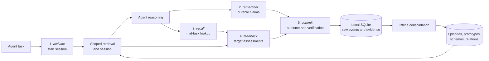

[](https://pypi.org/project/slowave/)
[](https://pypi.org/project/slowave/)
[](https://pypi.org/project/slowave/)
[](LICENSE)

---


**Living memory layer across your AI tools.**

---

One local memory for your AI agents across sessions, tools, and models.

- **Evolves with use:** Useful memories strengthen, irrelevant ones lose priority, and stale knowledge can be suppressed or superseded.
- **Learns from experience:** Decisions, outcomes, and multi-step approaches can become reusable memories and procedures.
- **Runs locally:** Slowave stores memory in SQLite and does not send it to a hosted memory service.
- **No separate LLM required:** The memory core performs maintenance and retrieval without separate model calls or an LLM API key.
- **Inspectable:** Review memories, retrievals, feedback, procedures, and system activity in the local dashboard.

Works with Claude Code, Codex, Cursor, Cline, Windsurf / Devin Desktop, OpenCode, and Claude Desktop.

## Day 1 demo

<p>
    
</p>

## Why Slowave?

Most agent memory systems treat memory mainly as a retrieval problem: they accumulate information in storage, search it, and then add the results back to the prompt. Over time, this creates noise: new decisions conflict with old ones, and irrelevant information pollutes the context window.

A common fix is an additional LLM layer that summarizes content and detects semantic signals such as contradiction or supersession. This adds significant token cost and latency while hiding memory management behind a second reasoning model.

Slowave implements a different paradigm:

> Your LLM agent is fully responsible for reasoning over the task and the retrieved memories.
>
> Slowave applies your agent signals to evolve memory through deterministic mechanisms.

The connected agent records durable knowledge and evaluates whether retrieved context is useful, irrelevant, or stale.

Slowave evolves that memory locally using embeddings, scopes, salience, associations, reinforcement, decay.

### Key features

- **One memory across all tools**: Claude Code, Codex, Cursor, and other tools can access the same local memory. You can change the client or model without starting over.

- **Memory evolves with use**: Directly recalled memories gain salience, and memories used together get co-activated, allowing related context to surface even when it does not literally match your query. Useful feedback reinforces memories, irrelevant ones lose priority, and stale information can be suppressed or superseded.

- **No extra LLM layer**: Slowave makes no LLM calls to summarize, merge, rewrite, or rerank memory. This avoids the extra model-token cost and latency. No LLM API key is required.

- **Fully local**: Slowave uses local embeddings and stores memory in SQLite. It does not send memory to a hosted memory service.

- **Learn from past experience**: Multi-step agent executions can become structured procedures in memory with context, steps, and caveats. When a similar task appears, the agent can retrieve what was tried, whether it worked or not, learning from past experiences.

- **Compact, flexible scoped context**: Slowave retrieves a small set of relevant memories instead of replaying an expanding transcript. Memories remain scoped until broader reuse is justified.

- **Local dashboard**: Inspect what was stored and retrieved, the source evidence and retrieval paths behind each memory, and the feedback submitted by your agents. You can also review procedures and lifecycle state, or reversibly suppress a memory without deleting its evidence.


## Installation

Install Slowave:

```bash
pipx install slowave
```

Preview the changes, configure detected clients, and verify the installation:

```bash
slowave setup --dry-run   # preview
slowave setup             # configure detected clients
slowave doctor            # verify the installation
```

`slowave setup` is idempotent and safe to run more than once. It:

- configures MCP
- installs the lifecycle instructions
- starts the daemon
- starts the background worker

> [!IMPORTANT]
> **No LLM API key required.**

Configure one client with `slowave setup --client <name>`. See [supported clients](#supported-clients) and the [installation reference](docs/install.md).

To remove Slowave, see the [removal guide](docs/install.md#remove-slowave).


## Long-term value

Slowave becomes more useful as experience accumulates across projects. 

What to expect:

- **Day 1**: Cold start seeds your first project scope. Agents immediately preserve decisions, preferences, constraints, and task outcomes. Context from one session is recallable in the next.
- **Week 1**: Feedback loops close. Repeated work across projects and tools builds a shared history. Useful memories reinforce; irrelevant ones fade; stale decisions get flagged. Agents start retrieving what helped before instead of re-deriving it.
- **Month 1**: Consolidation compounds. Cross-project patterns crystallize into reusable procedures with context, steps, and caveats. Agents retrieve not just facts but what was tried, what worked, what to avoid, turning accumulated experience into a compounding advantage for every new task.


Slowave provides persistence immediately. Its deeper value compounds through use.


## Dashboard

Start the local dashboard:

```bash
slowave dashboard
```

Open the dashboard to inspect memories, retrievals, procedures, activity, and system health.

<p align="center">
  <a href="img/overview.jpg">
    
  </a>
</p>

<p align="center">
    <a href="img/schemas.jpg"></a>
    <a href="img/procedures.jpg"></a>
    <a href="img/retrieval.jpg"></a>
    <a href="img/activity.jpg"></a>
    <a href="img/graph.jpg"></a>
</p>


## Supported clients

Client coverage is actively expanding. Suggest more integrations or report broken ones with setup details.

✅ = manually verified · ⬜ = pending verification

| Client         | macOS | Linux | Windows | Setup                                    |
|----------------|--|--|--|------------------------------------------|
| [Claude Code](integrations/claude-code/README.md) | ✅ | ✅ | ✅ | `slowave setup --client claude-code` |
| [Cline](integrations/cline/README.md) | ✅ | ✅ | ✅ | `slowave setup --client cline` |
| [Cursor](integrations/cursor/README.md) | ✅ | ✅ | ✅ | `slowave setup --client cursor` ¹ |
| [Windsurf](integrations/windsurf/README.md) | ✅ | ✅ | ✅ | `slowave setup --client windsurf` |
| [Claude Desktop](integrations/claude-desktop/README.md) | ✅ | ✅ | ✅ | `slowave setup --client claude-desktop` ¹ |
| [OpenCode](integrations/opencode/README.md) | ✅ | ✅ | ✅ | `slowave setup --client opencode` |
| [Codex](integrations/codex/README.md) | ✅ | ✅ | ✅ | `slowave setup --client codex` |
| All the above |  |  |  | `slowave setup` |

¹ requires one manual paste after setup

> [!IMPORTANT]
> The default embedding model downloads from Hugging Face on first use (~45 MB, cached locally). Subsequent runs work offline.
>
> Memory is stored in plaintext in the current OS user's application-data directory. Slowave does not send it to a hosted memory service. See [runtime data and migration](docs/install.md#runtime-data-location-and-migration).


## How Slowave memory works

Slowave works through 5 simple MCP tools:

- **Activate:** start a task and load relevant memory.
- **Remember:** save a fact, decision, preference, or instruction.
- **Recall:** search memory during a task.
- **Feedback:** mark retrieved memory as useful, irrelevant, or stale.
- **Commit:** save the task outcome and any reusable procedure.

A **background worker** consolidates relevant memories and procedures.

See [architecture.md](docs/architecture.md) and [design.md](docs/design.md) for more details.

### Slowave MCP lifecycle



See [architecture.md](docs/architecture.md) and [design.md](docs/design.md) for details.


## Boundaries

- Slowave is a memory layer, not a reasoning engine.
- It cannot recall information that was never recorded.
- It supplies relevant context, but the connected agent decides how to interpret and use it.
- Memory quality depends on the client agent and the feedback it provides.
- Slowave adds token overhead from tool calls and retrieved context.
- Slowave is in public beta. APIs, storage formats, and retrieval behavior may change before a stable release.

## Benchmarks

Slowave maintains and retrieves memory without LLM calls for ingestion,
consolidation, or recall. The results below measure whether its retrieved
evidence supports the right answer; they do not measure an LLM-generated final
answer.

| Benchmark | LLM-judge result | What it demonstrates |
| --- | ---: | --- |
| LoCoMo | **71.84%** | Explicit-fact retrieval across long conversations; **87.04%** on LoCoMo's multi-session category |
| LongMemEval oracle | **65.20%** | Retaining and combining supplied evidence sessions; this oracle split does not test retrieval among distractors |

The external judge was `deepseek/deepseek-v4-flash`. These values are not yet
directly comparable with leaderboard claims using different splits, answerers,
judges, or retrieval budgets.

See [benchmarks.md](docs/benchmarks.md) for category detail, how the judge
works, limitations, and exact local reproduction commands.


## Documentation

- [design.md](docs/design.md): design rationale, boundaries, and positioning
- [architecture.md](docs/architecture.md): brain-inspired memory model and lifecycle
- [install.md](docs/install.md): installation, setup, lifecycle instructions, modified files, and removal
- [benchmarks.md](docs/benchmarks.md): benchmark results, methodology, and reproduction
- [troubleshooting.md](docs/troubleshooting.md): daemon, worker, dashboard, client integration, database, backup/restore


## Contributing

Slowave is open source under the AGPL-3.0-or-later license.

Contributions are welcome, especially in:

- client integrations
- recall quality improvements
- evaluation datasets
- performance optimization

See [CONTRIBUTING.md](./CONTRIBUTING.md) before submitting a pull request.


## License

Slowave is open source under the [GNU AGPL-3.0-or-later](LICENSE) license.
