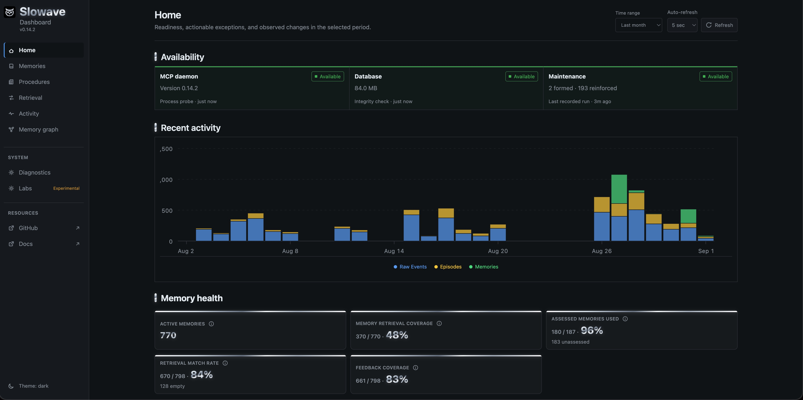
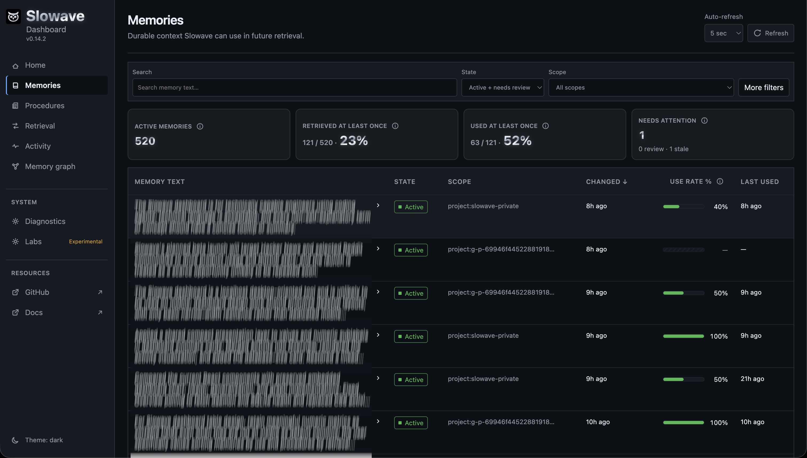
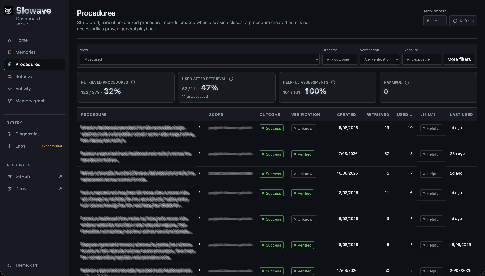
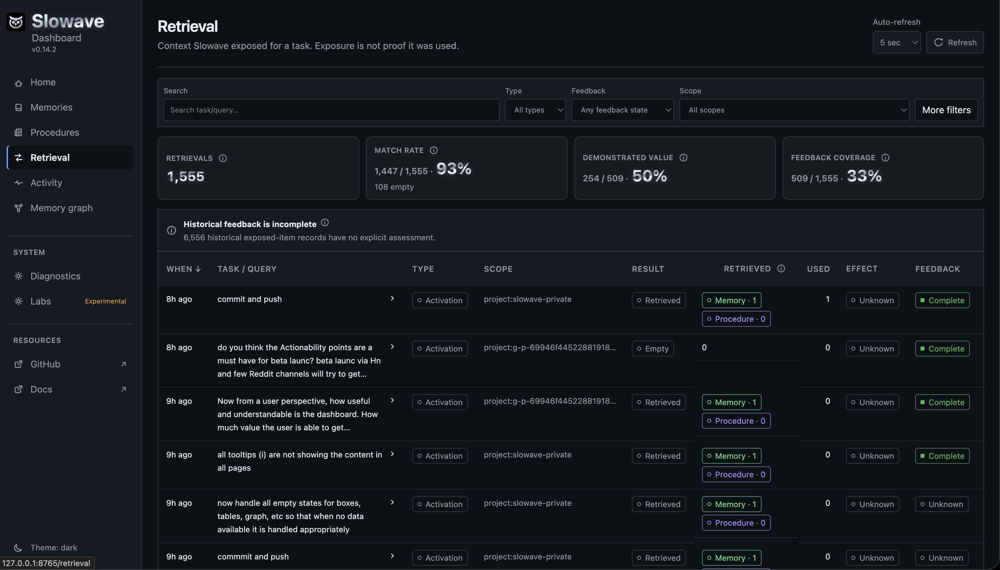
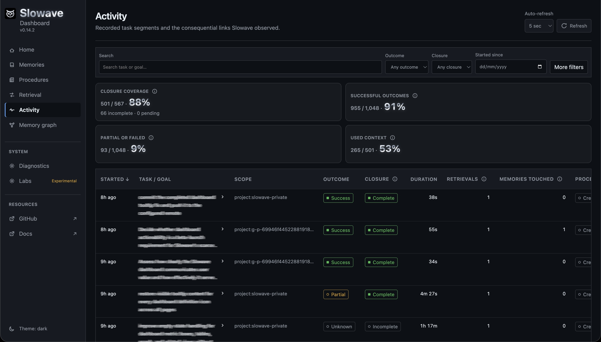
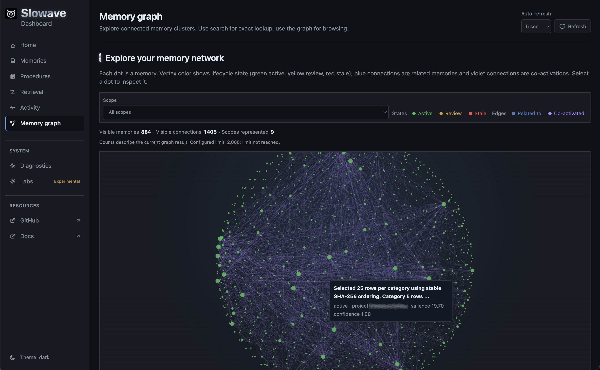
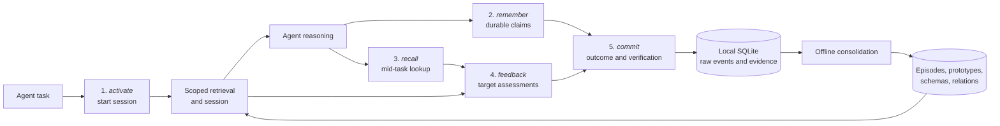

[](https://pypi.org/project/slowave/)
[](https://pypi.org/project/slowave/)
[](https://pypi.org/project/slowave/)
[](LICENSE)

---


**Living memory layer across your AI tools.**

---

Slowave gives your AI agents one local memory that persists across sessions, tools, and models.

- Relevant context is maintained across your sessions and tools.
- Useful memories are reinforced. Irrelevant memories fade.
- Past solutions and failures can become reusable procedures.
- Fully local. Memory is stored in SQLite. No data leaves your machine.
- Memory maintenance and retrieval require no LLM calls or LLM API key.
- Works via 5 simple MCP tools for your agent to call.
- Inspect and manage your growing memory through the local dashboard.

Works on Claude Code, Codex, Cursor, Cline, Windsurf, OpenCode, and Claude Desktop.

## Day 1 demo

<p>
    
</p>

## Why Slowave?

Most agent memory systems treat memory as a retrieval problem: they save conversations or extracted facts, search them later, and add the results back to the prompt. Over time that accumulates noise — new decisions conflict with old ones, and irrelevant information pollutes the context window.

A common fix is an LLM-driven maintenance layer that summarizes content and detects signals such as contradiction or supersession. That works, but it adds cost and latency and puts memory management behind a second reasoning layer. Slowave avoids this by letting the connected agent provide the judgment while it maintains memory locally.

Inspired by how biological memory keeps memory processes separate from reasoning, Slowave does not treat memory as a search problem. It maintains a compact store whose relevance self-regulates through use: recalled memories gain salience, memories returned together strengthen their associations, useful memories are reinforced, and stale ones decay. The payoff is a task primed with a small, current working-memory brief — not an ever-growing replay of everything that was ever saved.

Slowave implements a different paradigm:

> Use language models for reasoning and judgment.

> Use latent-space mechanisms for memory maintenance.

### Key features

- **One memory across all tools**: Claude Code, Codex, Cursor, and other tools can access the same local memory. You can change the client or model without starting over.

- **Your agent reasons, Slowave remembers what's relevant**: Your agent provides reasoning and judgment: it decides what is worth remembering and reports whether recalled context was useful, irrelevant, or stale. Slowave uses those signals to maintain memory without a separate LLM.

- **Memory evolves with use**: Directly recalled memories gain salience, and memories you use together become **co-activated** — linked so a related one surfaces even when it doesn't literally match your query. Useful feedback reinforces them further, irrelevant memories lose priority, and stale information can be suppressed or superseded.

- **No LLM calls**: Slowave uses local embeddings, scopes, time, salience, associations, reinforcement, decay, and offline consolidation. It makes no LLM calls to summarize, merge, rewrite, or rerank memory, avoiding additional token cost and latency.

- **Learn from past experience**: Task outcomes and multi-step methods can preserve structured procedures with context, steps, and caveats. When a similar task appears, the agent can retrieve what was tried before, whether it worked, and what to avoid.

- **Compact relevant context**: Slowave retrieves a compact set of relevant memories instead of replaying an expanding transcript or loading an ever-growing collection of files.

- **Flexible scoping**: Memories are initially siloed within the scope where they were learned. When a pattern proves useful across distinct scopes and sessions, Slowave can make it available more broadly with relevance safeguards.

- **Observable and actionable**: Memories, source evidence, retrieval paths, feedback, procedures, and lifecycle state are visible in the local dashboard. You can reversibly suppress a memory without deleting its evidence.

- **100% local**: Memory is stored in a local SQLite database. The default embedding model downloads once on first use and is cached locally; Slowave does not send memory to a hosted memory service.

The result is one local memory layer that works across agents, improves through use, and remains independent of any model provider.

## Installation

Install Slowave:

```bash
pipx install slowave
```

Preview the changes, configure detected clients, and verify the installation:

```bash
slowave setup --dry-run   # preview
slowave setup             # configure detected clients
slowave doctor            # verify the installation
```

`slowave setup` is idempotent and safe to run more than once. It:

- configures MCP
- installs the lifecycle instructions
- starts the daemon
- starts the background worker

> [!IMPORTANT]
> **No LLM API key required.**

Configure one client with `slowave setup --client <name>`. See [supported clients](#supported-clients) and the [installation reference](docs/install.md).

To remove Slowave, see the [removal guide](docs/install.md#remove-slowave).


## Long-term value

Slowave becomes more useful as experience accumulates across projects. 

What to expect:

- **Day 1**: Cold start seeds your first project scope. Agents immediately preserve decisions, preferences, constraints, and task outcomes. Context from one session is recallable in the next.
- **Week 1**: Feedback loops close. Repeated work across projects and tools builds a shared history. Useful memories reinforce; irrelevant ones fade; stale decisions get flagged. Agents start retrieving what helped before instead of re-deriving it.
- **Month 1**: Consolidation compounds. Cross-project patterns crystallize into reusable procedures with context, steps, and caveats. Agents retrieve not just facts but what was tried, what worked, what to avoid, turning accumulated experience into a compounding advantage for every new task.


Slowave provides persistence immediately. Its deeper value compounds through use.


## Dashboard

Start the local dashboard:

```bash
slowave dashboard
```

Open [http://127.0.0.1:8765](http://127.0.0.1:8765) to inspect memories, retrievals, procedures, activity, and system health.

<p align="center">
  <a href="img/overview.jpg">
    
  </a>
</p>

<p align="center">
    <a href="img/schemas.jpg"></a>
    <a href="img/procedures.jpg"></a>
    <a href="img/retrieval.jpg"></a>
    <a href="img/activity.jpg"></a>
    <a href="img/graph.jpg"></a>
</p>


## Supported clients

Client coverage is actively expanding. Suggest more integrations or report broken ones with setup details.

✅ = manually verified · ⬜ = pending verification

| Client         | macOS | Linux | Windows | Setup                                    |
|----------------|--|--|--|------------------------------------------|
| [Claude Code](integrations/claude-code/README.md) | ✅ | ✅ | ✅ | `slowave setup --client claude-code` |
| [Cline](integrations/cline/README.md) | ✅ | ✅ | ✅ | `slowave setup --client cline` |
| [Cursor](integrations/cursor/README.md) | ✅ | ✅ | ✅ | `slowave setup --client cursor` ¹ |
| [Windsurf](integrations/windsurf/README.md) | ✅ | ✅ | ✅ | `slowave setup --client windsurf` |
| [Claude Desktop](integrations/claude-desktop/README.md) | ✅ | ✅ | ✅ | `slowave setup --client claude-desktop` ¹ |
| [OpenCode](integrations/opencode/README.md) | ✅ | ✅ | ✅ | `slowave setup --client opencode` |
| [Codex](integrations/codex/README.md) | ✅ | ✅ | ✅ | `slowave setup --client codex` |
| All the above |  |  |  | `slowave setup` |

¹ requires one manual paste after setup

> [!IMPORTANT]
> The default embedding model downloads from Hugging Face on first use (~45 MB, cached locally). Subsequent runs work offline.
>
> Memory is stored in plaintext in the current OS user's application-data directory (`~/Library/Application Support/slowave` on macOS, normally `~/.local/share/slowave` on Linux, and `%LOCALAPPDATA%\slowave` on Windows). Slowave does not send it to a hosted memory service. Protect sensitive data with OS permissions or full-disk encryption. See [runtime data and migration](docs/install.md#runtime-data-location-and-migration).


## How Slowave memory works

Slowave works through 5 simple MCP tools:

- **Activate:** start a task and load relevant memory.
- **Remember:** save a fact, decision, preference, or instruction.
- **Recall:** search memory during a task.
- **Feedback:** mark retrieved memory as useful, irrelevant, or stale.
- **Commit:** save the task outcome and any reusable procedure.

A **background worker** consolidates relevant memories and procedures.

See [architecture.md](docs/architecture.md) and [design.md](docs/design.md) for more details.

### Slowave MCP lifecycle



**Mandatory:** <i>activate</i> → <i>feedback</i> → <i>commit</i>. **Optional:** <i>remember</i>, <i>recall</i> (only when the situation calls for them). The numbered ordering is per task; a task may call <i>remember</i>/<i>recall</i> many times.

See [architecture.md](docs/architecture.md) and [design.md](docs/design.md) for details.


## Boundaries

Slowave is a memory layer, not a reasoning engine.

- It cannot recall information that was never recorded.
- It supplies relevant context, but the connected agent decides how to interpret and use it.
- Memory quality depends on the client agent and the feedback it provides.
- Slowave is in public beta. APIs, storage formats, and retrieval behavior may change before a stable release.

## Benchmarks

Slowave maintains and retrieves memory without LLM calls for ingestion,
consolidation, or recall. The results below measure whether its retrieved
evidence supports the right answer; they do not measure an LLM-generated final
answer.

| Benchmark | LLM-judge result | What it demonstrates |
| --- | ---: | --- |
| LoCoMo | **71.84%** | Explicit-fact retrieval across long conversations; **87.04%** on LoCoMo's multi-session category |
| LongMemEval oracle | **65.20%** | Retaining and combining supplied evidence sessions; this oracle split does not test retrieval among distractors |

The external judge was `deepseek/deepseek-v4-flash`. These values are not yet
directly comparable with leaderboard claims using different splits, answerers,
judges, or retrieval budgets.

See [benchmarks.md](docs/benchmarks.md) for category detail, how the judge
works, limitations, and exact local reproduction commands.


## Documentation

- [design.md](docs/design.md): design rationale, boundaries, and positioning
- [architecture.md](docs/architecture.md): brain-inspired memory model and lifecycle
- [install.md](docs/install.md): installation, setup, lifecycle instructions, modified files, and removal
- [benchmarks.md](docs/benchmarks.md): benchmark results, methodology, and reproduction
- [troubleshooting.md](docs/troubleshooting.md): daemon, worker, dashboard, client integration, database, backup/restore


## Contributing

Slowave is open source under the AGPL-3.0-or-later license.

Contributions are welcome, especially in:

- client integrations
- recall quality improvements
- evaluation datasets
- performance optimization

See [CONTRIBUTING.md](./CONTRIBUTING.md) before submitting a pull request.


## License

Slowave is open source under the [GNU AGPL-3.0-or-later](LICENSE) license.
