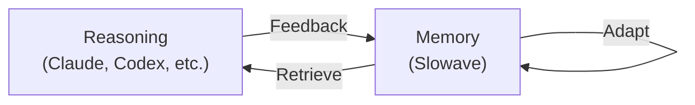
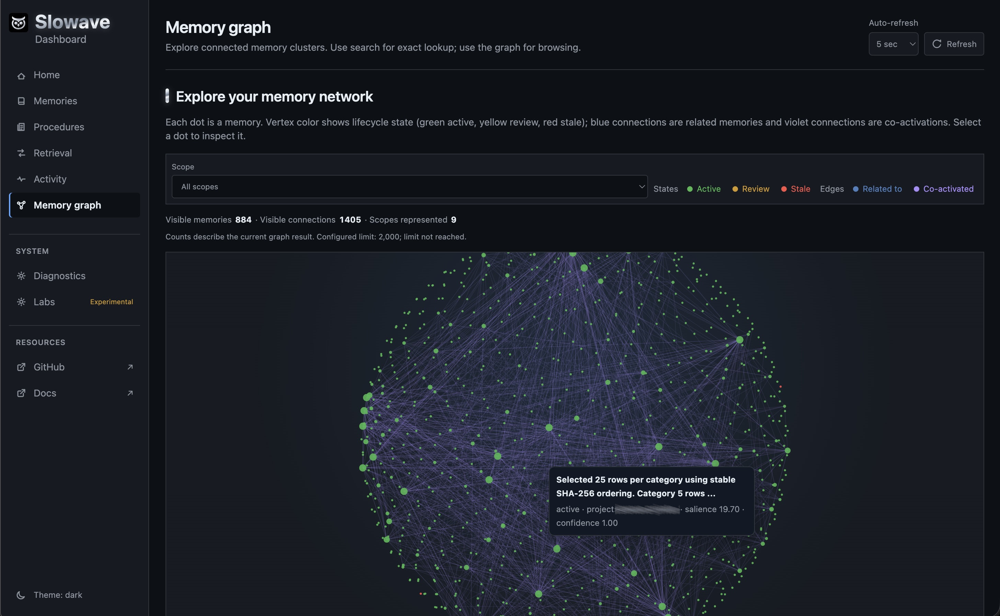
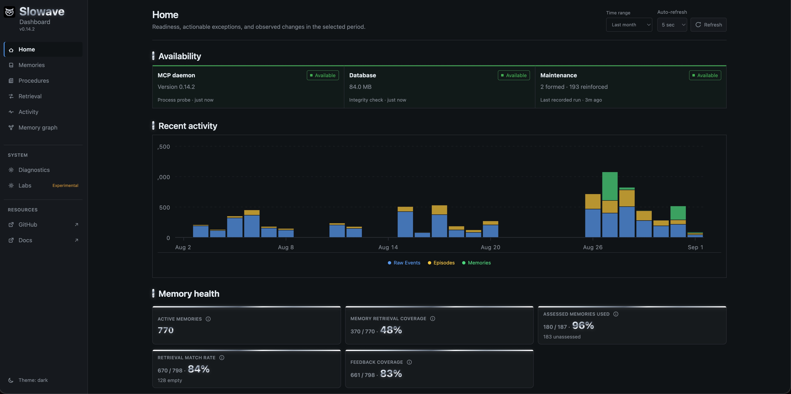
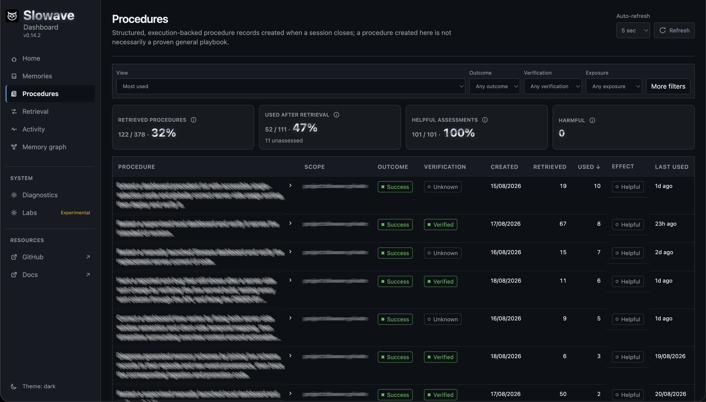
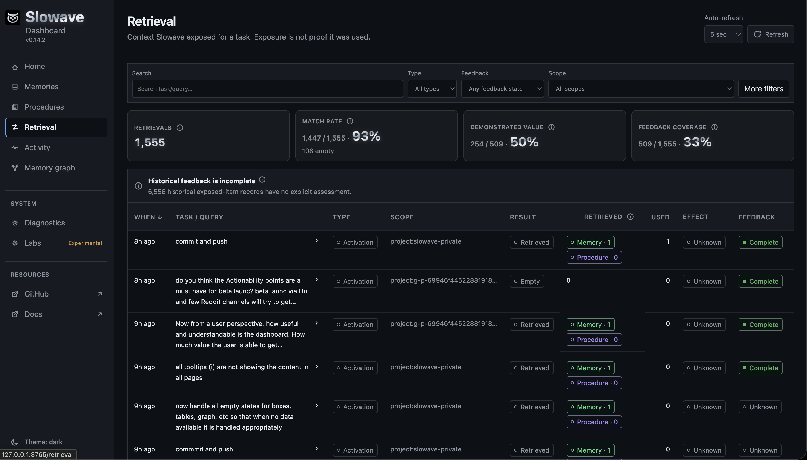
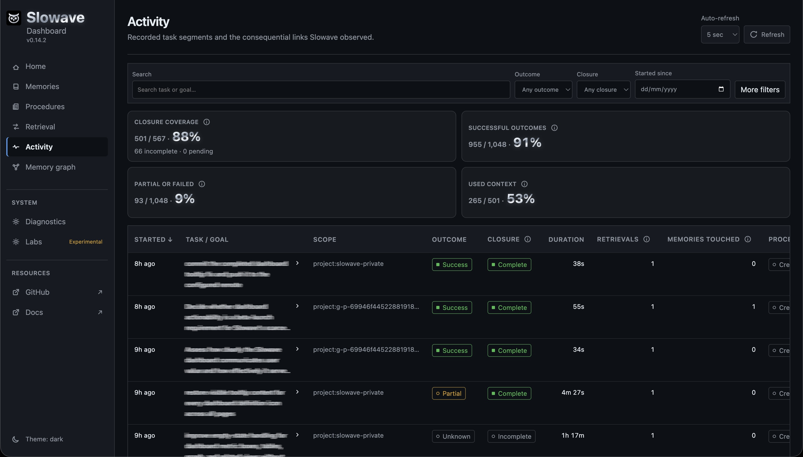
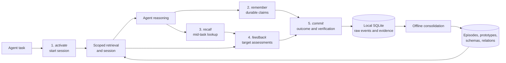

<!-- mcp-name: io.github.slowave-ai/slowave -->

---

<p align="center">
  
</p>
<p align="center">
  <b>Living memory layer across your coding agents and AI tools.</b>
</p>
<p align="center">
  <a href="https://pypi.org/project/slowave/"></a>
  
  
  
</p>
<p align="center">
  Supports: Claude Code, Copilot CLI, Codex, Cursor, OpenCode, Windsurf/Devin Desktop, Cline, Claude Desktop
</p>


---
AI agents have large context windows, but that context ends with your current session.
Open a new session, switch from Claude Code to Codex, and you have to restate the same decisions, constraints, and failed attempts.

Slowave gives your agents one local, shared memory, without requiring a separate LLM for memory maintenance.

Slowave is an adaptive memory layer that approaches agent memory from a specific angle:

> **Reasoning and memory form a continuous feedback loop.**


```mermaid
graph LR
    LLM["Reasoning<br/>(Claude, Codex, etc.)"]
    MEM["Memory<br/>(Slowave)"]
    
    LLM -->|Feedback| MEM
    MEM -->|Retrieve| LLM
    MEM -->|Adapt| MEM
```

Slowave retains what helps agents achieve their goals, weakens what does not, and continuously adapts based on use. It does this through a continuous feedback loop between your agent and its memory:

> **remember → recall → use → feedback → reinforce / weaken → decay**

Over time, your agent’s feedback shapes what Slowave returns, and your memories become reusable context for your agent to achieve its goals.

Memory is continuously reshaped by use rather than a static collection of facts waiting to be retrieved.

- **Keep context across tasks**: Your agents can reuse recorded decisions, preferences, constraints, and lessons instead of making you repeat them.
- **Improves with use:** Useful memories strengthen, irrelevant ones lose priority, stale knowledge can be suppressed or superseded.
- **Learns from experience:** Decisions, outcomes, and multi-step solutions can become reusable memories and procedures.
- **Runs locally:** Slowave stores memory in SQLite and does not send it to a hosted memory service.
- **No LLM API key:** The memory core performs maintenance and retrieval without LLM calls or an LLM API key.
- **Inspectable and measurable:** Review memories, retrievals, feedback, procedures, and system performance in the local dashboard.

The first useful payoff is simply not having to repeat the same constraint in the next task. 

Over time, the way you work becomes reusable context for your agent.

See [platform coverage and manual steps](#supported-clients).

## Installation

### Quick start
```bash
pipx install slowave
slowave setup --dry-run
slowave setup
```

The quick start configures every detected client. To configure just one client at a time, see the [installation reference](docs/install.md).

> [!IMPORTANT]
> **No LLM API key required.**

For upgrades and service management, see [Install, upgrade, run, and remove Slowave](docs/install.md).
Use `slowave start`, `slowave stop`, and `slowave restart` for installed services;
use `slowave status --services` and `slowave doctor` to diagnose problems.
See [Troubleshooting](docs/troubleshooting.md) for recovery and logs, or run
`slowave docs troubleshooting` to open it from your terminal.

## What changes in your workflow?

Slowave is transparent to your work. You keep working with your agent as usual. 

Slowave is strictly connected to your agent in both directions:

- **Agent → Slowave**: When your agent encounters a durable fact, decision, or procedure the installed lifecycle directs it to preserve that claim into Slowave.
- **Slowave → Agent**: At the beginning of each task Slowave may return a compact, scoped set of relevant recorded memories or procedures to your agent, so that it can act upon its own memories. 

What you will see while working with your agent:
- your agent activating Slowave for the current task and goal, 
- Slowave retrieving relevant context to your agent, 
- your agent sending feedback to Slowave on what was retrieved.
- your agent committing a Slowave session.

Optionally you will see:
- your agent invoking Slowave to remember durable facts.
- your agent invoking Slowave to recall something critical for the current task or goal.

Slowave does not decide whether a claim is true or important. Your agent makes
that judgment and reports whether retrieved memory helped, was irrelevant, or
became stale. Slowave maintains the resulting local memory.


## Dashboard

The local dashboard shows what Slowave is actually doing with your agent's memory over time: what it remembers, what it retrieves, and what your agent reports using.

As your history grows, you can follow a memory from where it came from to the tasks where it was later retrieved and used. You can inspect learned procedures, see when retrieved context was useful or irrelevant, and understand whether Slowave is helping your agent reuse past work rather than simply accumulating memories.

Start the dashboard with:

```bash
slowave dashboard
```

From the dashboard you can:

- **Inspect memories:** see what was saved, where it came from, its current state, and when it was later retrieved or used.
- **Inspect procedures:** review reusable methods captured from previous work and see when they are retrieved and reused.
- **Trace retrievals:** see the request, the context Slowave actually returned, and the feedback reported by the agent.
- **Follow activity:** inspect tasks, retrievals, feedback, memory updates, and their links to each other.
- **Explore memory connections:** browse relationships and associations between memories.
- **Check system health:** inspect the database, background maintenance, backups, and local services.

The overview also helps answer whether the memory loop is working: how many memories and procedures exist, how often retrieved context is reported as used, how much is marked irrelevant, whether feedback is being recorded, and how creation, retrieval, and use change over time.

Slowave also shows a rough estimate of the context returned through the MCP endpoints, so you can keep an eye on memory overhead.
<p align="center">
  <a href="img/graph.jpg"></a>
</p>

<p align="center">
    <a href="img/overview.jpg"></a>
    <a href="img/memories.jpg"></a>
    <a href="img/procedures.jpg"></a>
    <a href="img/retrieval.jpg"></a>
    <a href="img/activity.jpg"></a>
</p>


## Supported clients

Client coverage is actively expanding. Suggest more integrations or report broken ones with setup details.

✅ = supported. Copilot validation limits are listed below.

| Client         | macOS | Linux | Windows | Setup                                    |
|----------------|--|--|--|------------------------------------------|
| [Claude Code](integrations/claude-code/README.md) | ✅ | ✅ | ✅ | `slowave setup --client claude-code` |
| [Copilot CLI](integrations/copilot/README.md) | ✅ | ✅ | ✅ | `slowave setup --client copilot` |
| [Codex](integrations/codex/README.md) | ✅ | ✅ | ✅ | `slowave setup --client codex` |
| [Cursor](integrations/cursor/README.md) | ✅ | ✅ | ✅ | `slowave setup --client cursor` ¹ |
| [OpenCode](integrations/opencode/README.md) | ✅ | ✅ | ✅ | `slowave setup --client opencode` |
| [Windsurf](integrations/windsurf/README.md) | ✅ | ✅ | ✅ | `slowave setup --client windsurf` |
| [Cline](integrations/cline/README.md) | ✅ | ✅ | ✅ | `slowave setup --client cline` |
| [Claude Desktop](integrations/claude-desktop/README.md) | ✅ | ✅ | ✅ | `slowave setup --client claude-desktop` ¹ |
| All the above |  |  |  | `slowave setup` |

¹ requires one manual paste after setup

Copilot support targets local CLI execution. Automated integration tests pass, and
native configuration discovery is verified on macOS. A user also confirmed memory
reads and writes through Copilot CLI on macOS. Full model-driven lifecycle and native
Windows/Linux qualification remain pending. IDE, desktop, and hosted/cloud
Copilot support is deferred.

> [!IMPORTANT]
> The default embedding model downloads from Hugging Face on first use (~45 MB, cached locally). Subsequent runs work offline.
>
> Memory is stored in plaintext in the current OS user's application-data directory. Slowave does not send it to a hosted memory service. See [runtime data location](docs/install.md#runtime-data-location).


## How Slowave memory works

Slowave works through 5 simple MCP tools:

- `Activate`: start a task and load relevant memory.
- `Remember`: save a fact, decision, preference, or instruction.
- `Recall`: search memory during a task.
- `Feedback`: assess retrieved memories as `used`, `not_used`, `unassessable`, `irrelevant`, `already_known`, or `stale`.
- `Commit`: save the task outcome and any reusable procedure.

A **background worker** consolidates relevant memories and procedures.

### Slowave MCP lifecycle


```mermaid
flowchart LR
    A[Agent task] --> B[1. <i>activate</i><br/>start session]
    B --> C[Scoped retrieval<br/>and session]
    C --> D[Agent reasoning]
    D --> E[2. <i>remember</i><br/>durable claims]
    D --> F[3. <i>recall</i><br/>mid-task lookup]
    C --> G[4. <i>feedback</i><br/>target assessments]
    F --> G
    E --> H[5. <i>commit</i><br/>outcome and verification]
    G --> H
    H --> I[(Local SQLite<br/>raw events and evidence)]
    I --> J[Offline consolidation]
    J --> K[(Episodes, prototypes,<br/>schemas, relations)]
    K --> C
```

See [architecture.md](docs/architecture.md) and [design.md](docs/design.md) for details.


## Boundaries

- Slowave is a memory layer, not a reasoning engine.
- It cannot recall information that was never recorded.
- It supplies relevant context, but the connected agent decides how to interpret and use it.
- Memory quality depends on the client agent and the feedback it provides.
- Scopes reduce accidental context leakage; use separate stores when hard isolation is required.
- Slowave adds token overhead from tool calls and retrieved context.
- The local SQLite database is plaintext by default; protect it with OS permissions or full-disk encryption.

> [!IMPORTANT]
> Slowave is public beta software. APIs, configuration, and storage schema may change, and migrations are not guaranteed before stable release.

## Evaluation

The current evaluation notes report preliminary retrieval-evidence results,
methodology, limitations, and commands for running new evaluations. They do not
claim end-to-end agent accuracy or a comparison against other memory systems.
See [benchmarks.md](docs/benchmarks.md) before treating any result as a
production-quality claim.


## Documentation

- [Mintlify documentation](https://slowave-ai.mintlify.app/): full auto-generated documentation
- [design.md](docs/design.md): design rationale, boundaries, and positioning
- [architecture.md](docs/architecture.md): brain-inspired memory model and lifecycle
- [install.md](docs/install.md): installation, setup, lifecycle instructions, modified files, and removal
- [benchmarks.md](docs/benchmarks.md): benchmark results, methodology, and reproduction
- [troubleshooting.md](docs/troubleshooting.md): daemon, worker, dashboard, client integration, database, backup/restore


## Contributing

Slowave is open source under the AGPL-3.0-or-later license.

Contributions are welcome, especially in:

- installation and setup quality
- client integrations
- performance optimization

See [CONTRIBUTING.md](./CONTRIBUTING.md) before submitting a pull request.


## License

Slowave is open source under the [GNU AGPL-3.0-or-later](LICENSE) license.
